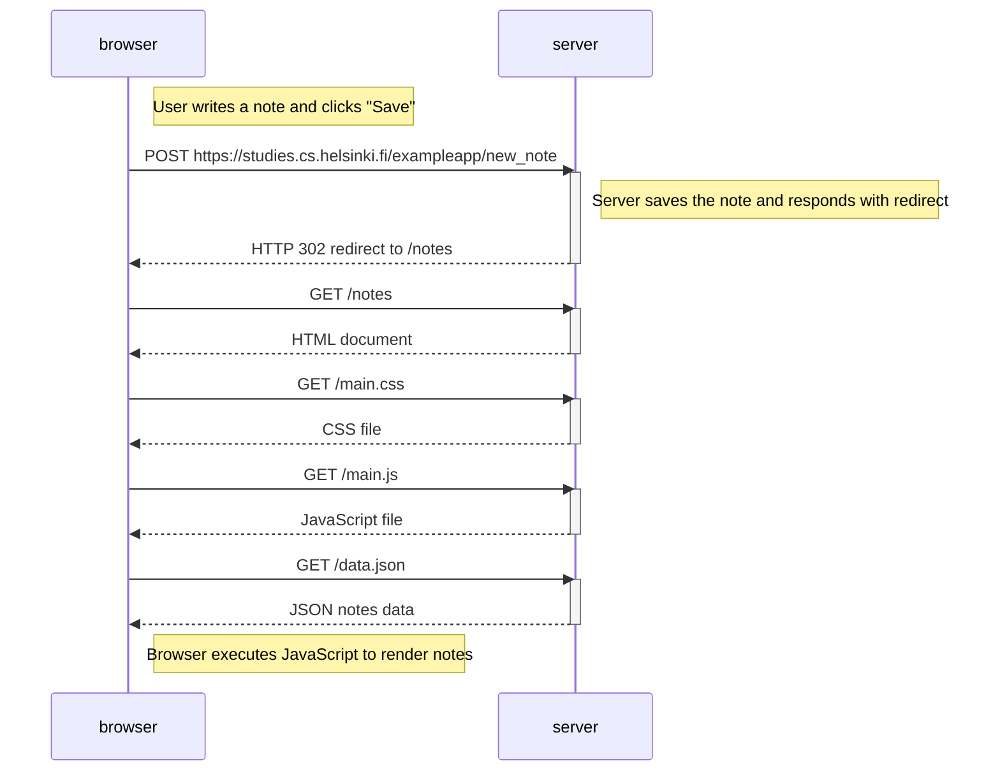

```mermaid
sequenceDiagram
    participant browser
    participant server

    Note right of browser: User writes a note and clicks "Save"

    browser->>server: POST https://studies.cs.helsinki.fi/exampleapp/new_note
    activate server
    Note right of server: Server saves the note and responds with redirect
    server-->>browser: HTTP 302 redirect to /notes
    deactivate server

    browser->>server: GET /notes
    activate server
    server-->>browser: HTML document
    deactivate server

    browser->>server: GET /main.css
    activate server
    server-->>browser: CSS file
    deactivate server

    browser->>server: GET /main.js
    activate server
    server-->>browser: JavaScript file
    deactivate server

    browser->>server: GET /data.json
    activate server
    server-->>browser: JSON notes data
    deactivate server

    Note right of browser: Browser executes JavaScript to render notes
```