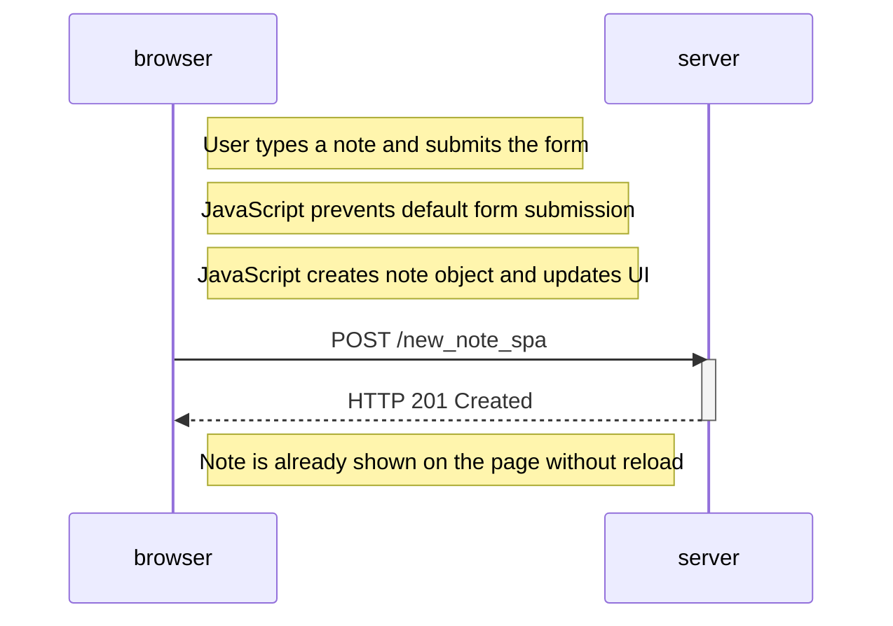

```mermaid
sequenceDiagram
    participant browser
    participant server

    Note right of browser: User types a note and submits the form

    Note right of browser: JavaScript prevents default form submission
    Note right of browser: JavaScript creates note object and updates UI

    browser->>server: POST /new_note_spa
    activate server
    server-->>browser: HTTP 201 Created
    deactivate server

    Note right of browser: Note is already shown on the page without reload
```